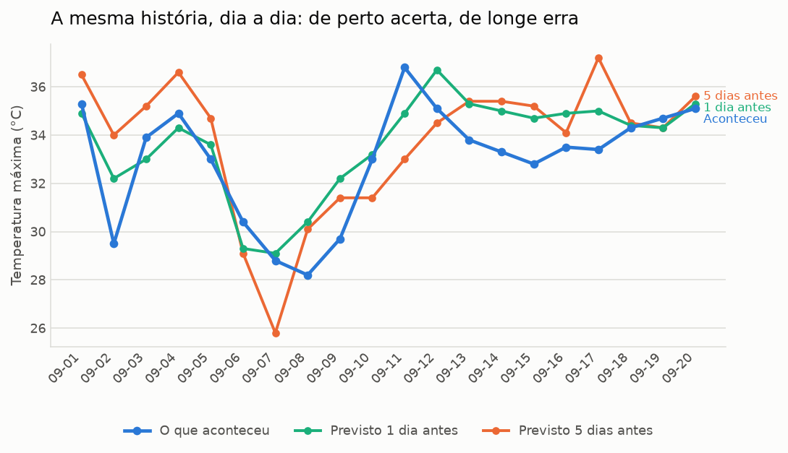

# Boletim semanal de acerto da previsão — Goiânia

**2026-09-21** · semana de 2026-09-14 a 2026-09-20 · 100 previsões no histórico

> Previsões conferidas: 100 recuperadas do arquivo de rodadas antigas do Open-Meteo. São previsões reais, emitidas antes da data que descrevem — nada aqui é simulado.

## Análise

Na semana de 2026-09-14 a 2026-09-20, o erro médio da temperatura máxima foi de 1.17 °C em 35 previsões conferidas — melhor que o acumulado, que está em 1.44 °C.

O viés de +1.09 °C indica que a previsão tende a ficar acima do que se observa. O acerto entre "vai chover" e "não vai" foi de 88.6%. O maior desacerto do histórico foi em 2026-09-02: previa 34.0 °C e foram 29.5 °C.

Na prática: com 1 dia de antecedência, conte com cerca de 1.19 °C de margem; com 5 dias, a margem sobe para perto de 1.79 °C. Para decisões que não podem errar, prefira confirmar na véspera.

texto automático (sem GEMINI_API_KEY). Os números são calculados em Python; a IA só redige, e o texto passa por uma auditoria que recusa qualquer número que não saia do cálculo.

## A semana, comparada

| Medida | Esta semana | Acumulado |
|---|---|---|
| Previsões conferidas | 35 | 100 |
| Erro médio da máxima | 1.17 °C | 1.44 °C |
| Erro médio da mínima | 0.89 °C | 0.89 °C |
| Viés da máxima | +1.09 °C | +0.73 °C |
| Acerto chove / não chove | 88.6% | 92.0% |

## Quanto a previsão erra, por antecedência

Sobre todo o histórico. É a regra central do boletim: a previsão de véspera é boa, a de uma semana é um palpite informado.

| Antecedência | Previsões | Erro médio máx. | Erro médio mín. | Viés máx. |
|---|---|---|---|---|
| 1 dia | 20 | 1.19 °C | 0.51 °C | +0.66 °C |
| 2 dias | 20 | 1.26 °C | 0.81 °C | +0.92 °C |
| 3 dias | 20 | 1.35 °C | 0.72 °C | +0.82 °C |
| 4 dias | 20 | 1.61 °C | 0.97 °C | +0.54 °C |
| 5 dias | 20 | 1.79 °C | 1.47 °C | +0.72 °C |

E a mesma regra vista dia a dia: a previsão feita 1 dia antes acompanha o que aconteceu; a de 5 dias se descola.

## Chuva: acertou o sim ou não?

Na semana. Considera-se que choveu a partir de 1.0 mm no dia.

| Situação | Dias |
|---|---|
| Previu chuva e choveu | 0 |
| Previu chuva e não choveu | 4 |
| Não previu e choveu | 0 |
| Previu seco e ficou seco | 31 |

## Maior desacerto do histórico

Em **2026-09-02**, com 5 dias de antecedência: previsto 34.0 °C, observado 29.5 °C (+4.5 °C).

---

Dados: Open-Meteo. O “observado” é a melhor estimativa da API para datas passadas (reanálise), não a leitura de uma estação específica. Gerado automaticamente por [GeocursoAtividade3](https://github.com/VictorGit10/GeocursoAtividade3).
