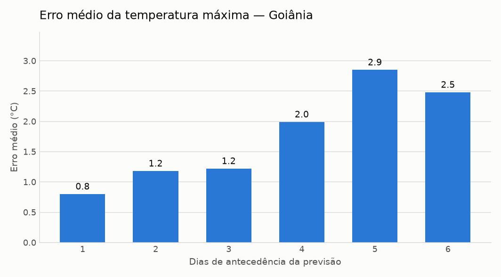
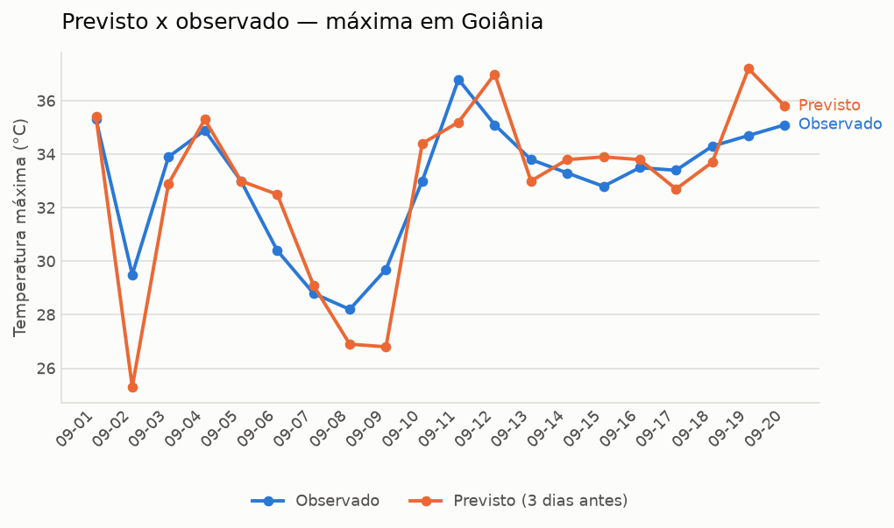

# Boletim de acerto da previsão — Goiânia

**Gerado em 2026-09-21** · 120 previsões conferidas (2026-09-01 a 2026-09-20)

> ⚠️ **MODO EXEMPLO** — Este boletim inclui previsões **simuladas** (`origem=exemplo`), criadas por `semear_exemplo.py` para demonstrar o formato antes de o histórico real encher. Os números de erro abaixo são ilustrativos, não uma medição.

## Análise

Nas 120 previsões conferidas entre 2026-09-01 e 2026-09-20, o erro médio da temperatura máxima foi de 1.75 °C. A qualidade cai com a distância: com 1 dia de antecedência o erro médio é 0.8 °C, e com 6 dias sobe para 2.48 °C.

O viés de +0.65 °C indica que a previsão tende a ficar acima do que se observa. Para chuva, o acerto entre "vai chover" e "não vai" foi de 75.0%. O maior desacerto do período foi em 2026-09-16: previa 40.8 °C e foram 33.5 °C.

texto automático (sem GEMINI_API_KEY). Todos os números foram calculados em Python; a IA apenas redigiu o texto.

## Os números

| Medida | Valor |
|---|---|
| Erro médio da máxima | 1.75 °C |
| Erro médio da mínima | 1.61 °C |
| Viés da máxima | +0.65 °C |
| Acerto chove / não chove | 75.0% |

### Erro por antecedência

| Antecedência | Previsões | Erro médio máx. | Erro médio mín. | Viés máx. |
|---|---|---|---|---|
| 1 dia | 20 | 0.8 °C | 0.8 °C | +0.7 °C |
| 2 dias | 20 | 1.18 °C | 0.77 °C | +0.83 °C |
| 3 dias | 20 | 1.22 °C | 1.56 °C | -0.09 °C |
| 4 dias | 20 | 1.99 °C | 1.69 °C | +0.64 °C |
| 5 dias | 20 | 2.85 °C | 2.64 °C | +0.6 °C |
| 6 dias | 20 | 2.48 °C | 2.19 °C | +1.22 °C |

### Chuva: acertou o sim ou não?

Considera-se que choveu a partir de 1.0 mm no dia.

| Situação | Dias |
|---|---|
| Previu chuva e choveu | 32 |
| Previu chuva e não choveu | 20 |
| Não previu e choveu | 10 |
| Previu seco e ficou seco | 58 |

### Maior desacerto do período

Em **2026-09-16**, com 5 dias de antecedência: previsto 40.8 °C, observado 33.5 °C (+7.3 °C).

---

Dados: Open-Meteo. O “observado” é a melhor estimativa da API para datas passadas (reanálise), não a leitura de uma estação específica. Gerado automaticamente por [GeocursoAtividade3](https://github.com/VictorGit10/GeocursoAtividade3).
